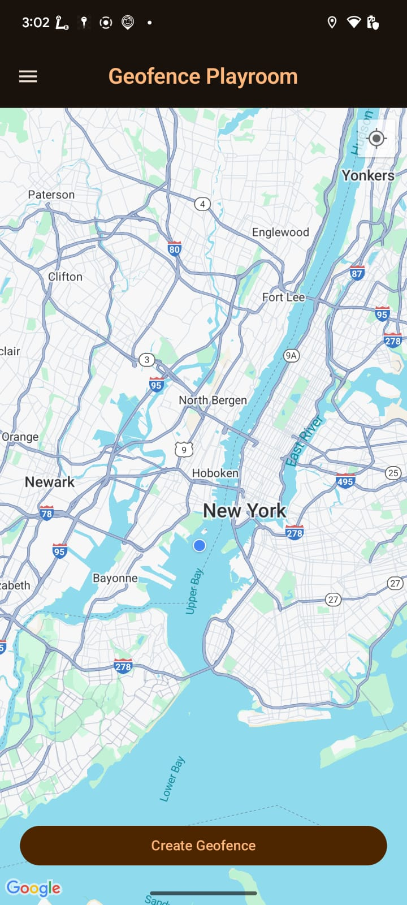

The Geofence App
==================
The Geofence App is a sample app that allows user to _create geofence_ by pinning a location on map and adjusting the it's radius. User will get a _notification_ whenever the fence is entered or exited.   
User can then view their created fences, deactivate, delete and reactivate. App also show the logs for geofence events (enter/exit) when user clicks on a saved geofence.   
App showcases working with android libraries such as Jetpack Compose (views, theming, animation, navigation), Google Maps Compose Library, BroadcastReceivers, Koin, Coroutines and Jetpack Navigation. 

## Screenshots
| App Launch Flow                                                                                              | Create Geofence Flow                                                                                                        | Manage Geofence Flow                                                                                               |
|--------------------------------------------------------------------------------------------------------------|-----------------------------------------------------------------------------------------------------------------------------|--------------------------------------------------------------------------------------------------------------------|
|  |  |  |

|    |   ||

# Features
This sample contains four screens: home screen, view geofences screen, fence triggered screen. User can create a geofence by clicking at a location on the map. Radius of geofence can be adjusted by dragging the radius marker.  

For app to function properly it need **location** permission while enabling `Allow all the time` settings. 
User can opt to give **notifications** permission to get updates when a geofence is triggered. 
App requests all the permission seamlessly during its normal flow of execution.

# Build and run the App
1. Clone the [Android App](https://github.com/shyamkp-11/GithubPlayroom) into Android Studio.
2. Get a Google Maps api key from https://console.cloud.google.com. 
3. Go to **secrets.properties** file (create in root project folder if there is none) and update
   > MAPS_API_KEY=(Your maps api key)
4. Gradle sync, clean and ▶️ Run the app `geofenceplayroom`.