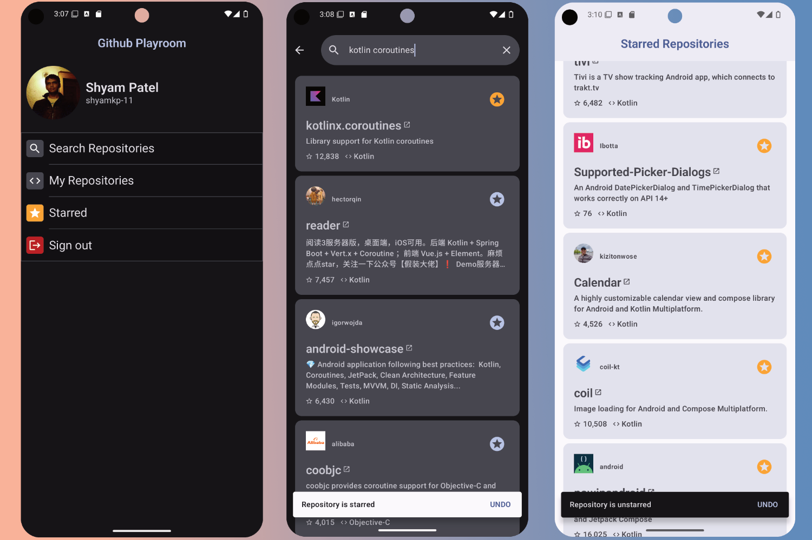

Github Playroom App
==================
Github Playroom is a sample app that primarily allows user to interact with Github using their Github Account.
It allow users to **search** and **view** _private_ _public_ repositories. It also allow user to **star ⭐️** repositories. Along with that user can opt to receive push notifications when somebody stars their repository. 

The app showcases working with latest android libraries such as Jetpack Compose (views, theming, animation, navigation), Koin, Kotlin coroutines, Jetpack Room, Firebase Messaging, ViewModels, Apollo Graphql, Retrofit build with clean architecture design.  
Project also implements unit testing with junit, integration tests with compose test, navigation component automated tests, and end-to-end test with UIAutomator. 

## Screenshots
| Login Flow                                                                                          | Push Notifications Flow                                                                                                  | Starring Repo Flow                                                                                           |
|-----------------------------------------------------------------------------------------------------|--------------------------------------------------------------------------------------------------------------------------|--------------------------------------------------------------------------------------------------------------|
|  |  |  |

[//]: # (![Login Flow]&#40;docs/GithubPlayroom%20login%20flow.gif "Login Flow"&#41;)

# Features
This sample contains four screens: home screen, search repositories screen, starred repositories screen and my repositories screen.
To receive push notifications for user owned repositories user has to enable it from home screen. 
User can star a repository or unstar a github repository from the app if authenticated.

# Run the App
App can run in an <mark>authenticated mode</mark> or <mark>unauthenticated</mark>. Without authentication user will only be able to search github repositories and unable to access starred repositories or personal repositories. 

# Build and run on your machine 

1. Sign in into [Github Login](https://github.com/login) or create a new account.
2. [Go to `Create a new Github App`](https://github.com/settings/apps/new).
3. Give a unique name to the app. Set `Homepage URL` to https://www.github.com. Set `Callback URL` to `auth://callback`.

   - [ ] Uncheck `Expire user authorization tokens`
   - [x] Check `Request user authorization (OAuth) during installation`
   - [x] Check Redirect on update In `Post Installation` 
   - [x] Uncheck `Active` under `Webhook`.
     - Give `Webhook URL` of the backend running https://github.com/shyamkp-11/github-webhooks-server.
     - Type a string to use as a secret key in `Secret` for the webhook delivery.
   - In `Account permissions` under `Permissions`:

     - Give `Read and write` access to `Starring`.

   - [x] Select `🔘 Any account` in `Where can this Github App be installed?`:
     
   - Click `Create GitHub App`.
   - After the Github App is created. In the Github App setting go to `Private Keys` section and click `Generate a private key`. 
   - Copy / save `App ID` of the Github App.
4. Clone the [Android App](https://github.com/shyamkp-11/GithubPlayroom) into Android Studio.
5. Go to **secrets.properties** file (If not there create one in the root folder of the project). And enter your
    >CLIENT_ID_GITHUBAPP=(Your App ID)  
    CLIENT_SECRET=(Your client secret)  
    APP_NAME=(Your app name)
6. Go to **gradle.properties** file, copy the GithubApp name in the url from your GithubApp settings page. Update in
   > APP_NAME_GITHUBAPP=(Your GithubApp name)
7. Save the _generated private key_ form [end of step #3](#step) into the `githubplayroom` directory of the project by the name `githubplayroom_private_key.pem`.
8. In the `Terminal` run the script file cd into `githubplayroom` and execute `pkcs1_to_pkcs8.sh`.
   This will convert the pkcs1 key to pkcs8 and save it by `githubplayroom_private_pkcs8.pem` which is compatible with our project implementation.
   

Now we create an OAuth App on Github since our previous GithubApp has some restrictions accessing 
Github rest/graphql API which prevents us to implement all the features the app intends to provide.

1. Sign in into [Github Login](https://github.com/login) or create a new account.
2. Go to [`Create a new OAuth application`](https://github.com/settings/applications/new).
3. Give a name to the app. Set `Homepage URL` to https://www.github.com. Set `Callback URL` to https://www.github.com.

   Click `Register application`.
4. Once created copy / save `Client ID`.
5. Click `Genereate a new client secret` and copy / save the client secret.
6. Clone the [Android App](https://github.com/shyamkp-11/GithubPlayroom) into Android Studio.
7. Go to **secrets.properties** file and enter your 
   > CLIENT_ID_OAUTH_APP=(Your client id)  
   > CLIENT_SECRET_OAUTH_APP=(Your client secret)

Make sure the [backend server](https://github.com/shyamkp-11/github-webhooks-server) for the app is running.
1. Use follow curl code to generate the jwt token to access backend server from mobile app.
``   
        curl --location '<app_server_base_url>/api/v1/auth/registerGithubApiClient' \
        --header 'Authorization: Bearer <admin_token> \
        --data-raw '
        {
            "firstname": "<first_name>",
            "lastname": "<last_name>",
            "role":"USER",
            "password": "<password>",
            "email": "<email>"
        }'
``
    Update token in **secrets.properties**:
    >  APP_SERVER_TOKEN=(your backend app server base-url) 
2. Update the backend server base url into **gradle.properties**.
    >  APP_SERVER_BASE_URL=(your backend app server base-url)

Create a project for your app in [Firebase](https://console.firebase.google.com). Download `google-services.json` and save it into `githubplayroom` directory of the project.

Gradle sync, clean and ▶️ Run the project.